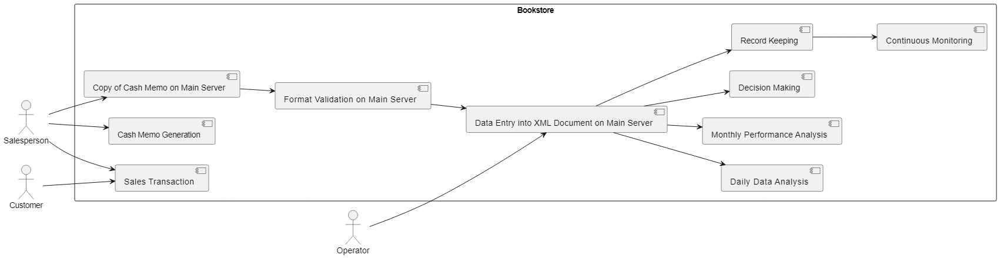

# Web Tchnologies Midsemester on project 3: Creative Learning project


## Software Requirement Specification

### Case Study

Creative Learning is a group of publishers located at New York. Recently, the organization has moved into retailing the books published at the publishing house. To start with, the organization has established bookstores at six locations in New York. However, the organization aims at increasing the number of bookstores in the forthcoming years. In addition, the organization is looking forward to establishing bookstores across all major states in the United States.  
To meet the competition in the retail market, the organization has decided to monitor the sales data of all six bookstores for a few months.The management of the organization has decided to develop an application that will track the sales record of each bookstore on a daily basis.The analysis of the tracked data will give the management a fair idea of the performance of each bookstore.

### Old method of tracking sales

All of the six bookstores in New York are connected to a main server over a LAN. The main ser ver is located at the head office of Creative Learning in New York. Whenever a book is purchased from any of the bookstores, the salesperson issues a cash memo to the customer. A cash memo is a Word document that contains details about the purchase made. The salesperson then sends the copy of the cash memo to the main server over the LAN.An operator at the head office makes an entry of each cash memo into an XML document. At the end of the day, the data in the XML document is analyzed to determine the sales from each bookstore. This data would then be analyzed at the end of the month to decide the performance of the bookstores.

#### Pseudocode

```
    Step 1: Sales Transaction at Bookstore
        Customer makes a purchase at the store.

    Step 2: Cash Memo Generation
        Generate a cash memo (Word document) with purchase details.

    Step 3: Copy of Cash Memo
        Provide a copy of the cash memo to the customer.

    Step 4: Data Transmission
        Send a copy of the cash memo to the main server over the LAN.

    Step 5: Data Entry at Head Office
        Operator at the head office manually enters data from cash memos into XML document.

    Step 6: Daily Data Analysis
        - For each store:
            - Calculate daily sales totals.
            - Generate daily sales reports.
            - Store daily sales data.

    Step 7: Monthly Performance Analysis
        - For each store:
            - Calculate monthly sales totals.
            - Analyze sales trends.
            - Compare performance between stores.

    Step 8: Decision Making
        - Based on monthly performance analysis, make informed decisions:
            - Allocate resources.
            - Plan marketing strategies.
            - Identify areas needing improvement.

    Step 9: Record Keeping
        Archive the XML document for future reference and auditing.

    Step 10: Continuous Monitoring
        - Repeat Steps 1-9 daily and monthly for ongoing sales management.
```

***The development team at Creative Learning has decided to automate the entire process.***

### New (Automated) Process

The development team at Creative Learning has decided to automate the entire process. When a salesperson issues a cash memo to a customer, the salesperson makes a copy of the cash memo in the specified directory on the main server. Then, on the main server, the format of the cash memo is checked for accuracy. Once the format is validated, the entry of the cash memo will be made into the XML document.The data in the document can then be easily analyzed to see the performance of each of the bookstores.

#### Pseudocode
```
    Step 1: Sales Transaction at Bookstore
        Customer makes a purchase at the store.

    Step 2: Cash Memo Generation
        Generate a cash memo (Word document) with purchase details.

    Step 3: Copy of Cash Memo on Main Server
        Salesperson copies the cash memo to the specified directory on the main server.

    Step 4: Format Validation on Main Server
        - Validate the format of the copied cash memo.
        - If format is not accurate:
            - Log an error.
            - Notify the salesperson or relevant personnel.
            - End process.
        - If format is accurate:
            - Continue to the next step.

    Step 5: Data Entry into XML Document on Main Server
        - Parse the validated cash memo.
        - Enter the cash memo details into the XML document.
        - Save the updated XML document.

    Step 6: Daily Data Analysis (optional)
        - For each store:
            - Calculate daily sales totals.
            - Generate daily sales reports.
            - Store daily sales data.

    Step 7: Monthly Performance Analysis (optional)
        - For each store:
            - Calculate monthly sales totals.
            - Analyze sales trends.
            - Compare performance between stores.

    Step 8: Decision Making (optional)
        - Based on analysis, make informed decisions:
            - Allocate resources.
            - Plan marketing strategies.
            - Identify areas needing improvement.

    Step 9: Record Keeping
        - Archive the XML document for future reference and auditing.

    Step 10: Continuous Monitoring
        - Repeat Steps 1-9 daily and monthly for ongoing sales management.

```

### Differences Introduced in Pseudocode 2:

1. **Copy of Cash Memo on Main Server:**
Added a step where the salesperson copies the cash memo to a specified directory on the main server.

2. **Format Validation on Main Server:**
Introduced a validation step on the main server to ensure the accuracy of the cash memo format before proceeding with data entry into the XML document.

3. **Data Entry into XML Document on Main Server:**
Modified the data entry step to include parsing the validated cash memo and entering details into the XML document on the main server.

### Requirements

#### 1. Functional Requirements:
* The application should be able to track the sales record of each bookstore daily.
* The application should be able to receive and process data from cash memos issued by salespersons.
* The application should validate the format of the cash memo on the main server for accuracy.
* The application should make entries of cash memos into an XML document.
* The application should allow for easy analysis of the data in the XML document to determine the performance of each bookstore.
* The application should be able to handle the sales data from multiple bookstores located in different locations.
* The application should be able to generate reports and insights based on the analyzed data to assist management in decision-making.
* The application should provide a user-friendly interface for salespersons to issue and store cash memos.

#### 2. Non-functional Requirements:
* Reliability: The application should be highly reliable and ensure data integrity during the sales tracking process.
* Performance: The application should be able to handle a large volume of data and process it efficiently.
* Scalability: The application should be designed to accommodate an increasing number of bookstores in the future without compromising performance.
* Security: The application should have appropriate security measures in place to protect the sales data and prevent unauthorized access.
* Usability: The application should have a simple and intuitive user interface to facilitate ease of use for salespersons and management.
* Maintainability: The application should be easily maintainable, allowing for future updates and enhancements.
* Compatibility: The application should be compatible with the existing LAN infrastructure and compatible with Windows operating systems.
* Integration: The application should seamlessly integrate with the main server and existing systems at Creative Learning's head office. 

### Use Case Diagram



## Technical documentation

### Website Design Specification

To create a website that performs the automated process described in the second pseudocode, you would typically need several pages, each serving a specific purpose in the overall sales management system. The main pages considered were:

1. **Homepage:**
   - Overview of the system.
   - Quick links to essential functions.
   - Login/Authentication options.

2. **Sales Entry Page:**
   - Form for salespersons to enter new sales transactions.
   - Generation of cash memos.

3. **View Database**
    - Show all fields and records of Customers, Stores and Books
    - Concise read-only view

4. **View Transactions**
    - Show all fields and records of database
    - Concise read-only view

5. **Update Database**
    - Shows forms to _Create_, _Update_, and _Delete_ records of Customers, Stores and Books
    - Expands and collapses as needed to prevent unnecessary editing

6. **Update Transactions**
    - Shows forms to _Create_, _Update_, and _Delete_ records of Transactions
    - Expands and collapses as needed to prevent unnecessary editing

7. **About**
    - Help and support
    - FAQ


### Database Design Specification
For the automated process described, there is the need for several tables in the database to store relevant information. Some of these tables along with their potential fields to be used are:

1. *books* table
    - ***(isbn)***
    - book_name	
    - author

2. *bookstores* table
    - ***(bookstore_id)***	
    - bookstore_name	
    - city	
    - state

3. *customers* table
    - ***(customer_id)***	
    - customer_name

4. *transactions* table
    - ***(transaction_id)***	
    - **customer_id**	
    - **bookstore_id**	
    - **isbn**	
    - transaction_date	
    - amount

_NB: Primary keys in ***(bold and bracket)*** Foreign keys in **bold** only_

#### Corresponding SQL code
```
   -- Database: `creativelearning`
--

-- --------------------------------------------------------

--
-- Table structure for table `books`
--

CREATE TABLE `books` (
  `isbn` varchar(255) NOT NULL,
  `book_name` varchar(255) NOT NULL,
  `author` varchar(255) NOT NULL
) ENGINE=InnoDB DEFAULT CHARSET=utf8mb4 COLLATE=utf8mb4_general_ci;

-- --------------------------------------------------------

--
-- Table structure for table `bookstores`
--

CREATE TABLE `bookstores` (
  `bookstore_id` int(11) NOT NULL,
  `bookstore_name` varchar(255) NOT NULL,
  `city` varchar(255) NOT NULL,
  `state` varchar(255) NOT NULL
) ENGINE=InnoDB DEFAULT CHARSET=utf8mb4 COLLATE=utf8mb4_general_ci;

-- --------------------------------------------------------

--
-- Table structure for table `customers`
--

CREATE TABLE `customers` (
  `customer_id` int(11) NOT NULL,
  `customer_name` varchar(255) NOT NULL
) ENGINE=InnoDB DEFAULT CHARSET=utf8mb4 COLLATE=utf8mb4_general_ci;

-- --------------------------------------------------------

--
-- Table structure for table `transactions`
--

CREATE TABLE `transactions` (
  `transaction_id` int(11) NOT NULL,
  `customer_id` int(11) DEFAULT NULL,
  `bookstore_id` int(11) DEFAULT NULL,
  `isbn` varchar(13) DEFAULT NULL,
  `transaction_date` date DEFAULT NULL,
  `amount` decimal(10,2) DEFAULT NULL
) ENGINE=InnoDB DEFAULT CHARSET=utf8mb4 COLLATE=utf8mb4_general_ci;

```
### Other information worth Knowing
- [How I made diagrams](readme/graph.md)
- [How I added session management](readme/session_management.md)